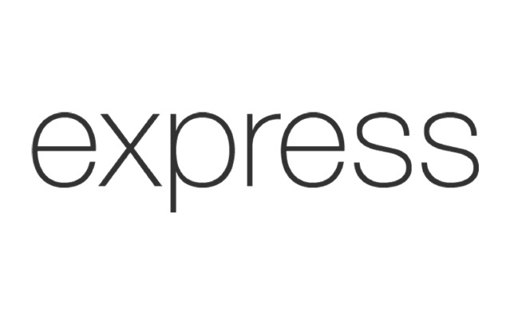

# Greetings! 👋

## A Dedicated Developer by Daily and a Gamer by Habit 🌞

### Current Position:
- **Full-Stack Developer at Djarum Group Affiliates**

### My Toolkit:
- **Programming Languages:** 
  -   JavaScript
  -  C
- **Frontend Development:** 
  -  HTML
  -  CSS
  -  Bootstrap
- **Backend Development:**
  -  Node.js
  -  Express.js
  -  EJS
- **Database:**
  -  MySQL
- **Data Visualization**
  -  Chart.js
- **Software:**
  -  Postman
  -  Figma

### Let’s Collaborate!
Feel free to **ping me** about coding 💻, developing 🛠️, gaming 🎮, tech innovations 🚀 etc.
